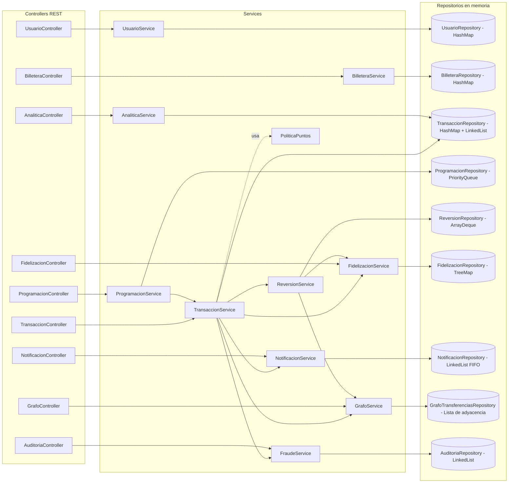
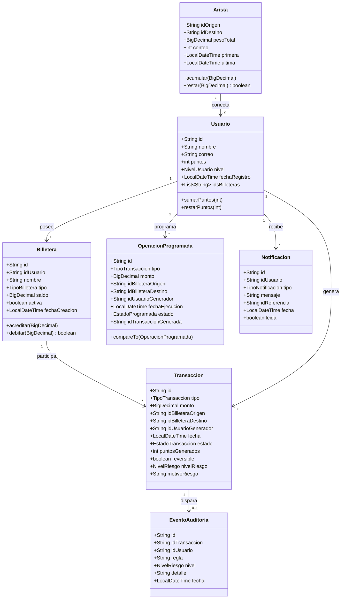
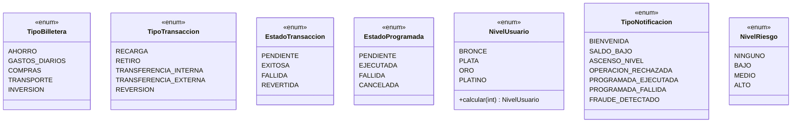
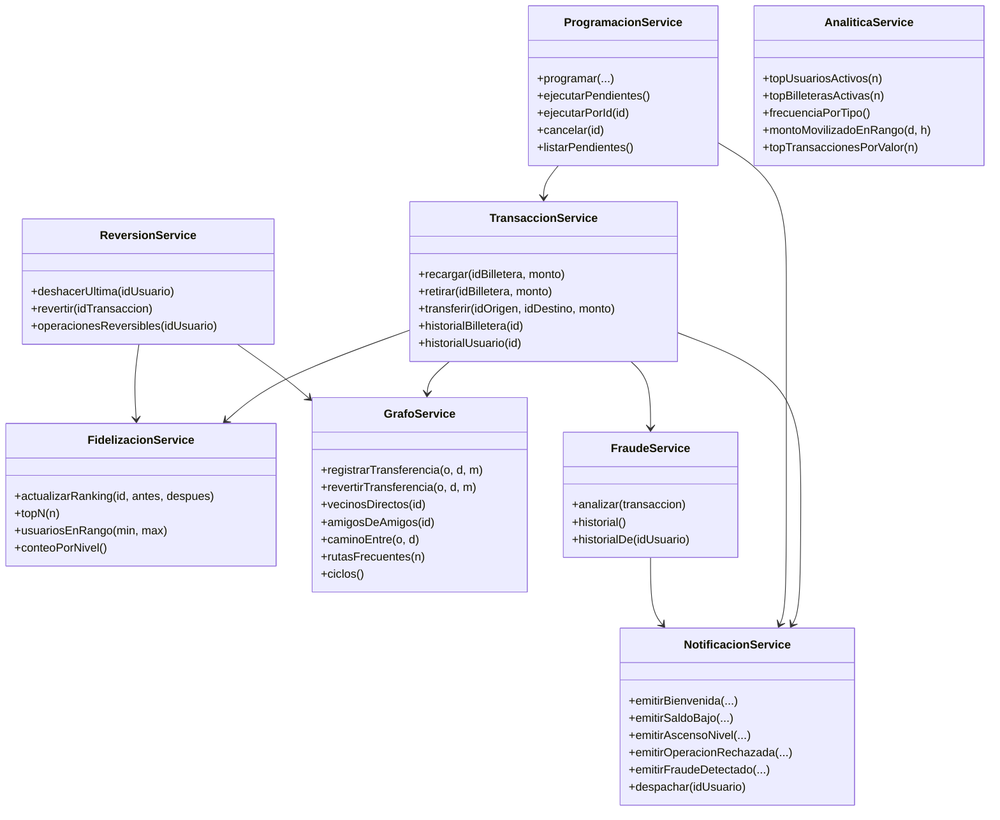
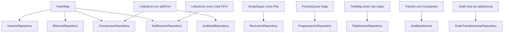

# Diagrama de clases

Diagramas en formato Mermaid. GitHub los renderiza automaticamente al
abrir este archivo desde la interfaz web del repositorio.

---

## 1. Vista general por capas

Muestra como se organizan las capas del backend y la relacion gruesa
entre cada servicio, su repositorio y los objetos de dominio que toca.

---

## 2. Dominio principal

Clases de negocio y los enums que las clasifican.

---

## 3. Enums

---

## 4. Servicios y sus colaboradores

Detalle de quien llama a quien en la capa de logica. Util para
entender el flujo de una transaccion completa.

---

## 5. Mapa estructura de datos / clase

Resumen visual de cual estructura clasica vive en cada repositorio.

